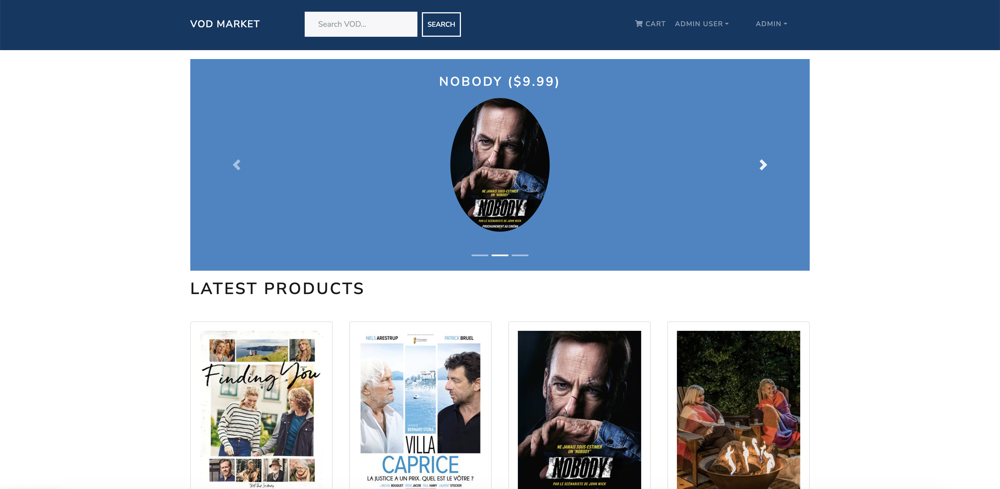

<table><tr><td></td></tr></table>

# Usage

## VOD Marketplace (MongoDB, NodeJS, ExpressJS, ReactJS & JWT)

### Clone Repositorie

Clone this Repositorie to your local machine

```
git clone https://github.com/eugenebelieve/vod-market.git
```

### Add Env Variables

Create or modify the .env file in then root and add the following (modify ATLAS_URI_HERE)

```
NODE_ENV = 'development'
PORT = '5000'
MONGO_URI = "ATLAS_URI_HERE"
JWT_SECRET = 'random_secret_key'
PAYPAL_CLIENT_ID = 'YOUR_PAYPAL_ID_HERE'
```

You don't need to provide a paypal id to test the code

### Install Dependencies (frontend & backend)

You need to execute these commands from the root folder (vod-market)

```
npm install
cd application
npm install
```

### Import Dataset

You have to use the following commands to generate sample users and VOD catalog as well as destroy all data, directly in your Database

```
# To Import VODs & User Data, run command from root directory (vod-market)
npm run data:vod

```

### Run

```
# Run frontend Application (:3000) & Microservices (:5000), from root directory (vod-market)
npm run dev
```

### Generated Accounts

```
#Sample User Logins created

admin@example.com (Admin)
123456

john@example.com (Customer)
123456

jane@example.com (Customer)
123456
```

## More Previews (Product & Shopping Cart)

<table>
<tr>
    <td></td>
    <td></td>
</tr>
</table>
